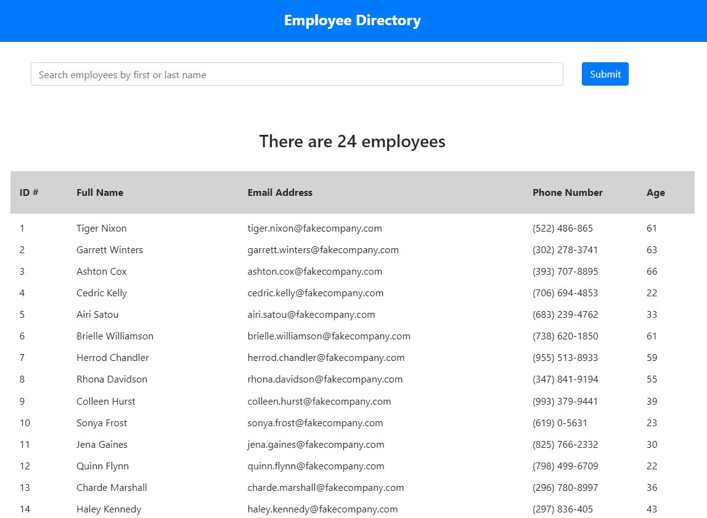
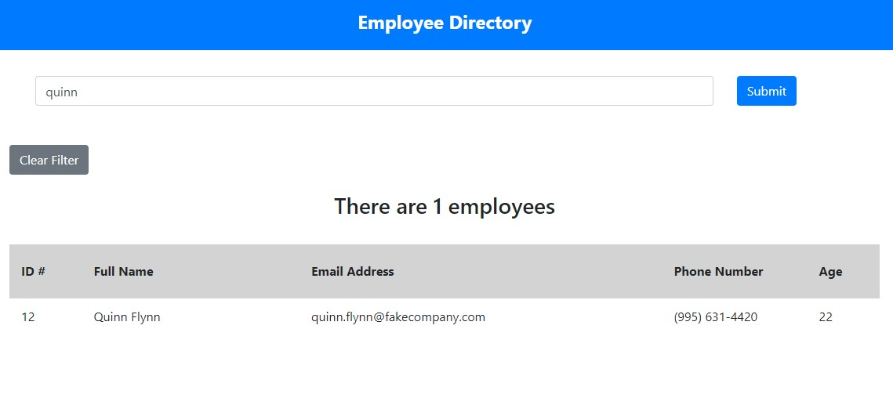

# Unit 19 React Homework: Employee Directory

## Overview

This is a employee directory created with React. The application's UI is broken up into components, manages component state, and responds to user events.

## User Story

* As a user, I want to be able to view my entire employee directory at once so that I have quick access to their information.

## Business Context

An employee or manager will benefit greatly from being able to view non-sensitive data about other employees. It is particularly helpful to be able to filter employees by name.

## Acceptance Criteria

Given a table of random users, when the user loads the page, a table of employees renders. 

The user is able to:

  * Sort the table by at least one category

  * Filter the users by at least one property.

## Links
<!-- the application is not successfully deploying to heroku. Once I troubleshoot that, I will uncomment this line.
However, I hope that won't affect my grade, since heroku deployment isn't required. Even though it wasn't required, I wanted to at least try it. -->
<!-- The deployed application: [https://practice-employee-directory.herokuapp.com/](https://practice-employee-directory.herokuapp.com/) -->

This application's Github repository: [https://github.com/SamSherrill/19th-homework](https://github.com/SamSherrill/19th-homework)